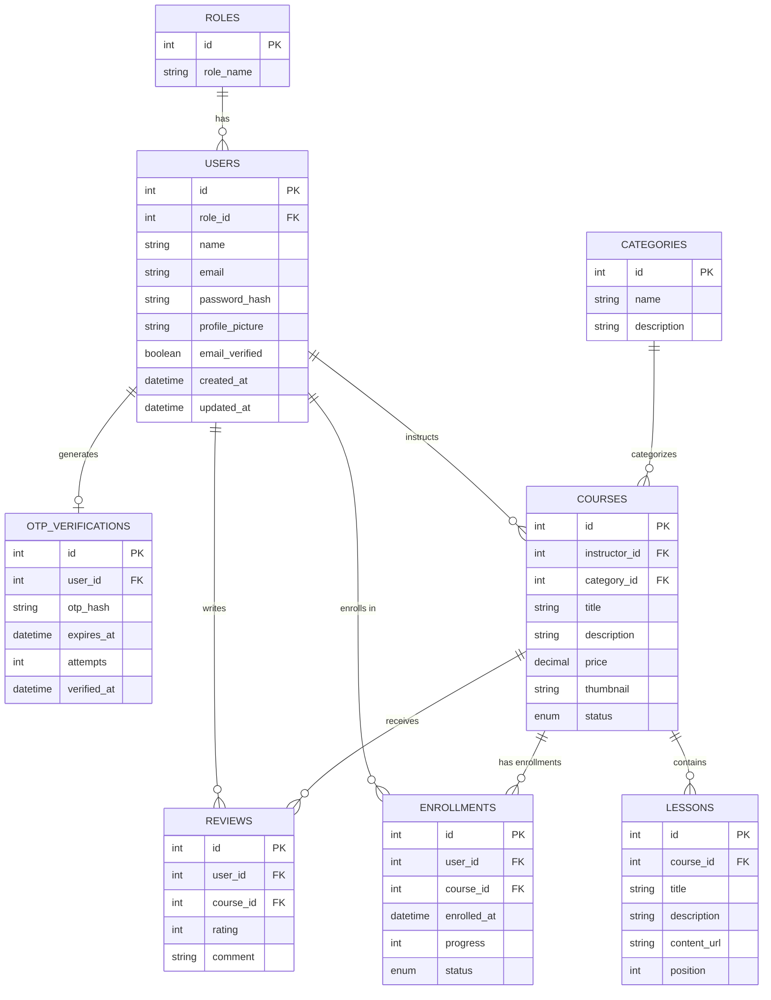

# Database Design & ER Diagram

## Entities and Relationships

The `elearning_db` database is normalized (3NF) and contains the following tables:

1.  **roles**: Defines system roles (Admin, Instructor, Student).
2.  **users**: Stores user accounts.
    *   `role_id` (FK to roles)
3.  **otp_verifications**: Stores OTPs for email verification.
    *   `user_id` (FK to users)
4.  **categories**: Course categories.
5.  **courses**: Created by instructors, belong to a category.
    *   `instructor_id` (FK to users)
    *   `category_id` (FK to categories)
6.  **lessons**: Content units within a course.
    *   `course_id` (FK to courses)
7.  **enrollments**: Tracks student enrollments (Many-to-Many between users and courses).
    *   `user_id` (FK to users)
    *   `course_id` (FK to courses)
8.  **reviews**: Student reviews for courses.
    *   `user_id` (FK to users)
    *   `course_id` (FK to courses)

## ER Diagram

